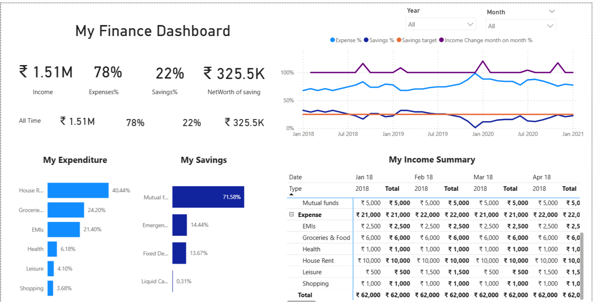

# Personal Finance Dashboard - Power BI

# Overview

This Power BI dashboard provides a comprehensive view of monthly income, savings, and expenditures. It is designed to help users visualize trends, track financial goals, and identify opportunities for better financial planning.

# Skills Demonstrated

- Data Cleaning using Power Query
- Time Series Visualization
- Dynamic Dashboards with slicers and filters
- DAX for calculated measures
- Data Modeling and relationships
- Interactive KPI Tracking

# Data Categories

- **Income**: Salary, Secondary Income  
- **Savings**: Mutual Funds, Emergency Fund, Fixed Deposit, Liquid Cash  
- **Expenses**: House Rent, Groceries & Food, Health, EMIs, Leisure, Shopping

# Key Insights

- Monthly and yearly trends in income, savings, and expenses  
- Category-wise expense distribution  
- Comparison of income vs. expenses to track surplus/deficit  
- Savings percentage over time  
- Dynamic filtering by month and category  

# Tools Used

- Power BI Desktop  
- Power Query Editor  
- DAX (Data Analysis Expressions)  
- Custom Visuals and Interactive Slicers  

# File

- `Vanshika Finance Dashboard.pbix` – Power BI file containing all visuals, transformations, and calculations.

# Purpose of the Project

As an aspiring Data Analyst, I built this project to demonstrate my data visualization, modeling, and storytelling abilities using real-world financial scenarios. This dashboard reflects my approach to solving analytical problems and communicating insights effectively.

# Preview

